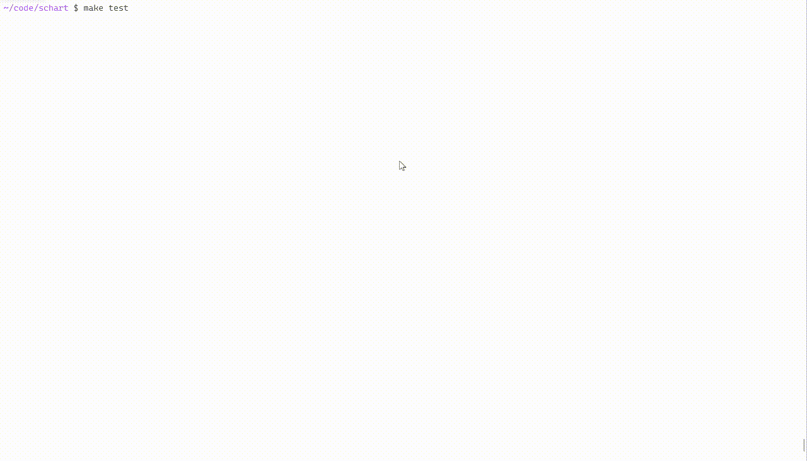

# schart
一个练手项目：在终端里画柱状图，用来给排序算法做可视化。

## 用法
编译运行 demo（选择排序动画）：
``` 
make
./build/test
```
或在代码中使用（单翻译单元，仅在一个 .c 中包含）：
```
#include "schart.h"
init_schart();
draw_chart(nums, n);
delay_ms(500);
```
## API
- `init_schart()` — 获取终端尺寸并清屏，最先调用
- `draw_chart(int \numbers, int n)` — 画一帧柱状图
- `schart_set_pillar_color_number(int idx)` — 柱体颜色，0–15
- `schart_set_background_color_number(int idx)` — 背景颜色，0–15
- `delay_ms(int ms)` — 延时
- `home_cursor()` — 光标归位
## 限制
仅 Linux，需 ANSI 终端；暂不支持多翻译单元、窗口 resize。颜色索引见代码内注释。
## 许可
MIT。

src/debug.h 来自 NJU NEMU 项目（Mulan PSL v2）。
